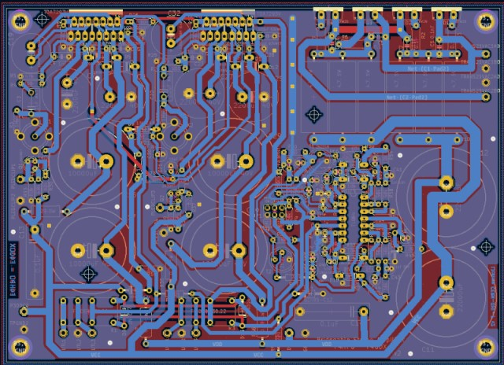

<h1 align="center">The tda_bridge Project</h1>

[ en Français](./documentation/README_fr.md)

This repository contains a [KiCAD 6.0.9](https://www.kicad.org/) project for an electronics board (hardware).

This electronics board is a bridgeable audio stereo amplifier, based on a pair of TDA7293 chips.

## Concept

The schematics around the TDA7293 was inspired by ST [datasheet](http://www.st.com/web/en/resource/technical/document/datasheet/CD00001887.pdf) and improved by [Francis Ibre for better sound.](http://www.cinetson.org/phpBB3/electronique-f13/1er-ampli-diy-question-diverse-t17238-30.html)

It includes onboard the same card both a power Supply and a watchdog to protect the loudspeakers against continuous voltage.

In addition, this stereo amplifier could easily be converted into a high power mono amplifier (bridge mode) by soldering R26, removing R28 and shunting R25.

## Historical background

A first implementation was made by authors (F4HPU and F4GUX) as reported in [Fangorn's blog](http://fangorn.over-blog.org/article-23233481.html).

Then, a first design was started using [Eagle (free version)](https://www.autodesk.fr/products/eagle/free-download) in 2014. The design then stoped as the size of the board was beyond the limitation of the free version of the CAD software.

Fortunately, in the mean time KiCAD team upgraded highly this wonderful tool and the project could be switched seamlessly to KiCAD 6.0.9.

For this historical reason, the 3D view of the card is not working well as there was no 3D view for the libraries converted from Eagle.

## Technical information

| Characteristics       | Value                              |
| --------------------- | ---------------------------------- |
| Output Power in 8 ohm | 2x70W (stereo) or 1x280W (bridged) |
| Circuit Dimensions    | 176.5mm x 128.5 mm                 |

## Building Instructions

You have two options wether you wish to build the project as is (i.e. without using KiCAD), or tweak it to fit to your needs:

1. Download the [latest release](https://github.com/f4hpu/tda_bridge/releases/download/v0.0.0-alpha/fabrication.tar.gz) of this project "as is"
2. or git clone this repo (or even download a zip of the directory) and install [KiCAD 6.0.9](https://www.kicad.org/) to open the project. From here, you can tweak the schematics, the routing and generate your Gerber files.

Once you have the gerber files, you can build the 2-sided PCB.

In case you wish to use a single sided PCB, authors guess that's possible if you put straps for the few missing connections. The ground plane effect may be less effective and the noise floor may rise up a little.

KiCAD offers the possibility to print a BOM to buy everything you need for the card by itself. But of course you may want to add some other stuffs, like the power supply transformer, a power switch, a potentiometer to control the output level, a box, a big heatsink (around ~0.4deg/W) for both the TDA7293's and the Diode's. You may find some inspiration in 
[Fangorn's blog - article 1](http://fangorn.over-blog.org/article-22214740.html)/[article 2](http://fangorn.over-blog.org/article-23233481.html), or [Erriez Guitar Amplifier](https://github.com/Erriez/DualTDA7293PowerAmplifier)

### Continuous voltage protection

A continuous voltage may arm the speaker. For this reason, authors included a circuit continuously watching both left and right outputs. In case of any failure both left and right speakers are disconnected.

The system is a custom design by F4HPU and F4GUX, which behavior was simulated using [LTSpice](https://www.analog.com/en/design-center/design-tools-and-calculators/ltspice-simulator.html).

A Jumper was included to select between using this watchdog, or bypassing it.

### Bridge mode

The Bridge mode is a special mode where the two lines of the stereo amplifier are used simultaneously to drive a single loudspeaker. Simply speaking, for an input signal V_in, left output is (A.V_in), while right output is (-A.V_in), therefore output between left and right is four times higher (as voltage is twice higher).

If you foresee to use this amplifier as a _stereo amplifier_ you need to: remove R26, solder R28, solder R25. In this case, the speakers shall be connected between ground and output_left for left speaker, and ground and output_right for right speaker.

But if you foresee to use this amplifier as a _high power mono amplifier_ you need to: solder R26, remove R28, replace R25 by a shunt. In this case, the speaker shall be connected between output_left and output_right.

## Licencing and Property

The design was made by F4HPU and F4GUX, who are [French Amateur Radio Operators.](https://www.r-e-f.org/)

Both Schematics and PCB are licensed under [CERN-OHL-P version 2](https://cern-ohl.web.cern.ch/home). 

IMPORTANT NOTE: CURRENT DESIGN HAS NEVER BEEN TESTED FOR REAL YET, SO BE CAREFULL, USE AT YOUR OWN RISKS.

For this reason, you are highly encouraged to check each functionnality step by step.
