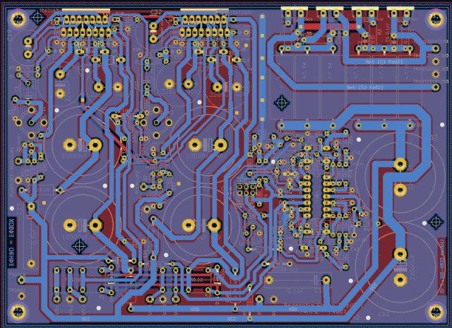

<h1 align="center">Projet tda_bridge</h1>

[ in English](../README.md)

Ce dépôt contient un projet [KiCAD 6.0.9](https://www.kicad.org/) pour une carte électronique (hardware).

Cette carte électronique est un amplificateur stéréo audio avec option mode ponté (bridged), basé sur une paire de circuits TDA7293.

## Concept

Le schéma autour du TDA7293 s'inspire de la [documentation ST](http://www.st.com/web/en/resource/technical/document/datasheet/CD00001887.pdf) et amélioré par [Francis Ibre pour un meilleur son.](http://www.cinetson.org/phpBB3/electronique-f13/1er-ampli-diy-question-diverse-t17238-30.html)

Il inclut sur la même carte à la fois une alimentation et un chien de garde pour protéger les haut-parleurs contre les tensions continues.

En outre, cet amplificateur stéréo pourrait facilement être converti en un amplificateur mono de haute puissance (mode pont) en soudant R26, en enlevant R28 et en shuntant R25.

## Bref historique

Une première implémentation a été réalisée par les auteurs (F4HPU et F4GUX) comme indiqué dans [le blog de Fangorn](http://fangorn.over-blog.org/article-23233481.html).

Ensuite, un premier design a été commencé en utilisant [Eagle (version libre)](https://www.autodesk.fr/products/eagle/free-download) en 2014. Le design s'est ensuite arrêté car la taille de la carte dépassait les limitations de la version gratuite du logiciel de CAO.

Heureusement, entre-temps, l'équipe de KiCAD a mis à niveau ce merveilleux outil et le projet a pu passer sans problème à KiCAD 6.0.9.

Pour cette raison historique, la vue 3D de la carte ne fonctionne pas bien car il n'y avait pas de vue 3D pour les bibliothèques converties depuis Eagle.

## Données Techniques

| Characteristiques               | Valeurs                            |
| ------------------------------- | ---------------------------------- |
| Puissance de Sortie dans 8 ohms | 2x70W (stereo) or 1x280W (ponté)   |
| Dimensions du Circuit           | 176.5mm x 128.5 mm                 |

## Construction d'une carte tda_bridge

Vous avez deux options : soit vous souhaitez construire le projet tel quel (c'est-à-dire sans utiliser KiCAD), soit vous souhaitez le modifier pour l'adapter à vos besoins :

1. Téléchargez la [dernière release] (https://github.com/f4hpu/tda_bridge/releases/download/v0.0.0-alpha/fabrication.tar.gz) de ce projet "tel quel". L'archive contient la BOM (liste de composants), un répertoire avec les fichiers gerber, et des fichiers pdf utiles.
2. ou clonez ce dépôt git (ou même téléchargez un zip du répertoire) et installez [KiCAD 6.0.9](https://www.kicad.org/) pour ouvrir le projet. A partir de là, vous pouvez modifier les schémas, le routage et générer vos fichiers Gerber.

Une fois que vous avez des fichiers gerber, vous pouvez construire le PCB double-face.

Si vous souhaitez utiliser un PCB simple face, les auteurs pensent que c'est possible si vous mettez des straps pour les quelques connexions manquantes. L'effet du plan de masse peut être moins efficace et le bruit de fond peut augmenter un peu.

KiCAD offre la possibilité d'imprimer une nomenclature pour acheter tout ce dont vous avez besoin pour la carte en elle-même. Mais bien sûr, vous pouvez vouloir ajouter d'autres choses, comme le transformateur d'alimentation, un interrupteur, un potentiomètre pour contrôler le niveau de sortie, un boîtier, un grand dissipateur thermique (environ ~0.4deg/W) à la fois pour les TDA7293 et les diodes. Vous pouvez trouver de l'inspiration dans
[blog de Fangorn - article 1](http://fangorn.over-blog.org/article-22214740.html)/[article 2](http://fangorn.over-blog.org/article-23233481.html), ou [l'ampli de guitare de Erriez](https://github.com/Erriez/DualTDA7293PowerAmplifier)

### Protection contre les tensions continues

Une tension continue peut abîmer un haut-parleur. Pour cette raison, les auteurs ont inclus un circuit qui surveille en permanence les deux sorties gauche et droite. En cas de défaillance, les haut-parleurs gauche et droit sont déconnectés.

Le système est une conception personnalisée par F4HPU et F4GUX, dont le comportement a été simulé en utilisant [LTSpice](https://www.analog.com/en/design-center/design-tools-and-calculators/ltspice-simulator.html).

Un cavalier a été inclus pour choisir d'utiliser ce chien de garde ou de le contourner.

### Mode ponté (Bridged)

Le mode ponté (bridged) est un mode spécial où les deux lignes de l'amplificateur stéréo sont utilisées simultanément pour piloter un seul haut-parleur. En clair, pour un signal d'entrée V_in, la sortie gauche est (A.V_in), tandis que la sortie droite est (-A.V_in). Ce faisant, la puissance de sortie se trouve quatre fois plus élevée (car la tension est deux fois plus élevée).

Si vous prévoyez d'utiliser cet amplificateur comme un _amplificateur stéréo_, vous devez : enlever R26, souder R28, souder R25. Dans ce cas, les enceintes doivent être connectées entre la masse et la sortie_gauche pour l'enceinte gauche, et la masse et la sortie_droite pour l'enceinte droite.

Mais si vous prévoyez d'utiliser cet amplificateur comme un _amplificateur mono de forte puissance_ vous devez : souder R26, enlever R28, remplacer R25 par un shunt (court-circuit). Dans ce cas, le haut-parleur doit être connecté entre output_left et output_right.

## Licences et propriété

La conception a été réalisée par F4HPU et F4GUX, qui sont [des radioamateurs français] (https://www.r-e-f.org/).

Les schémas et le PCB sont sous licence "Open Hardware" [CERN-OHL-P version 2](https://cern-ohl.web.cern.ch/home).

NOTE IMPORTANTE : LA CONCEPTION ACTUELLE N'A ENCORE JAMAIS ÉTÉ VRAIMENT TESTÉE, DONC SOYEZ PRUDENT, UTILISEZ À VOS PROPRES RISQUES.

Pour cette raison, vous êtes fortement encouragés à vérifier chaque fonctionnalité étape par étape.

